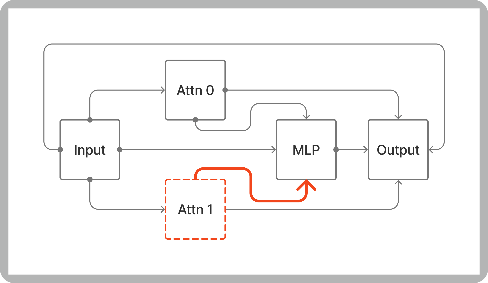
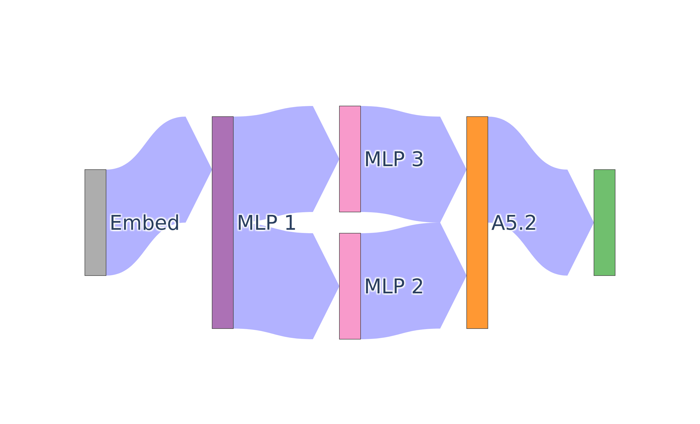

[](https://pypi.org/project/auto-circuit/)
[](https://github.com/UFO-101/auto-circuit/releases)
# AutoCircuit


A library for efficient patching and automatic circuit discovery.

[](https://UFO-101.github.io/auto-circuit)

## Read the paper
[Transformer Circuit Metrics are not Robust](https://arxiv.org/abs/2407.08734) (Oral spotlight, [COLM 2024](https://colmweb.org/AcceptedPapers.html))

## Getting Started

```bash
pip install auto-circuit
```

### Easy and Efficient Edge Patching
https://github.com/UFO-101/auto-circuit/blob/03ce552ccdea98fc6fed3b05cfb2df9b0eb4e323/experiments/demos/zero_ablate_an_edge.py#L20-L26

### Different Ablation Methods
https://github.com/UFO-101/auto-circuit/blob/03ce552ccdea98fc6fed3b05cfb2df9b0eb4e323/experiments/demos/patch_an_edge.py#L37

### Automatic Circuit Discovery
https://github.com/UFO-101/auto-circuit/blob/03ce552ccdea98fc6fed3b05cfb2df9b0eb4e323/experiments/demos/patch_an_edge.py#L49-L55

### Visualization
https://github.com/UFO-101/auto-circuit/blob/5777057b445d55b7d4695eed8aface9d6bcefbe3/experiments/demos/patch_some_edges.py#L49



## Cite this library
```
@inproceedings{
  miller2024transformer,
  title={Transformer Circuit Evaluation Metrics Are Not Robust},
  author={Joseph Miller and Bilal Chughtai and William Saunders},
  booktitle={First Conference on Language Modeling},
  year={2024},
  url={https://openreview.net/forum?id=zSf8PJyQb2}
}
```
