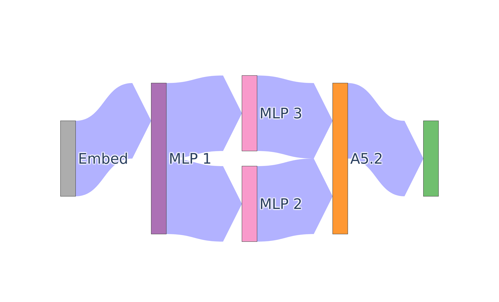

## Installation
```
pip install auto-circuit
```

## Patch some edges

### Imports
```python
--8<-- "experiments/demos/patch_some_edges.py:1:11"
```

### Load a model
```python
--8<-- "experiments/demos/patch_some_edges.py:11:14"
```

### Load a dataset
Datasets files must be in the
[specified format][auto_circuit.data.load_datasets_from_json].
You can download the example IOI dataset file from the
[AutoCircuit repo](https://github.com/UFO-101/auto-circuit/blob/main/datasets/ioi/ioi_vanilla_template_prompts.json).
```python
--8<-- "experiments/demos/patch_some_edges.py:15:23"
```

### Prepare the model for patching
This function builds the computational graph, wraps the model in the
[PatchableModel][auto_circuit.utils.patchable_model.PatchableModel] class and injects
[PatchWrapper][auto_circuit.utils.patch_wrapper.PatchWrapperImpl] instances that wrap
all of the [SrcNode][auto_circuit.types.SrcNode]s and
[DestNode][auto_circuit.types.DestNode]s in the model.
```python
--8<-- "experiments/demos/patch_some_edges.py:25:32"
```

### Gather activations to be patched into the model
```python
--8<-- "experiments/demos/patch_some_edges.py:33:34"
```

### Run the patched model
```python
--8<-- "experiments/demos/patch_some_edges.py:35:47"
```

### Visualize the patched edges
```python
--8<-- "experiments/demos/patch_some_edges.py:47:49"
```



### All together
```python
--8<-- "experiments/demos/patch_some_edges.py:1:50"
```
