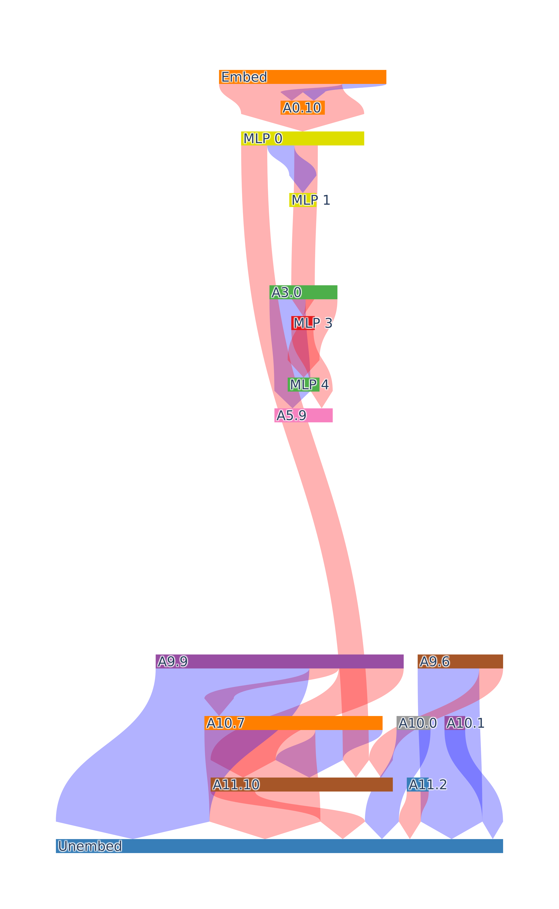
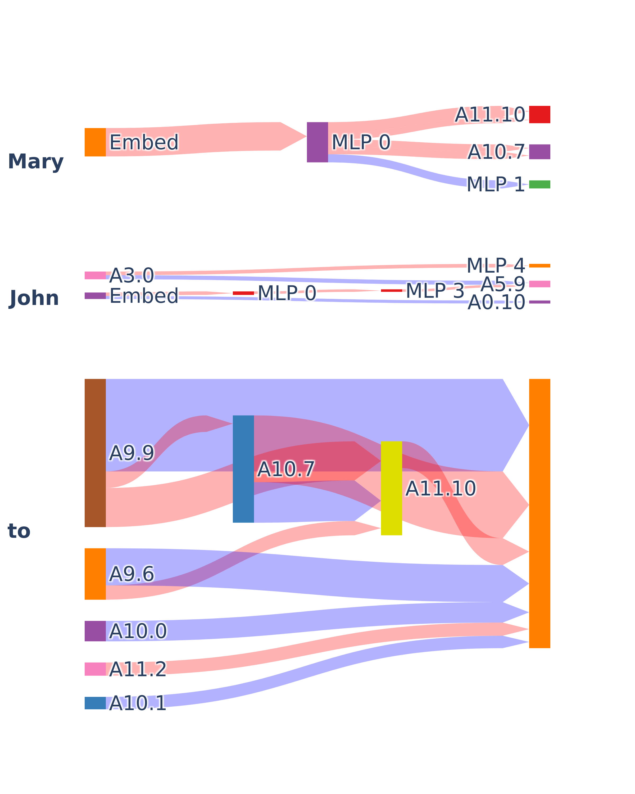

## Prepare model and data

```python
--8<-- "experiments/demos/circuit_discovery.py:1:31"
```

## Edge Attribution Patching circuit discovery
Mask gradients are a faster way to compute Edge Attribution Patching, see the [reference
documentation][auto_circuit.prune_algos.edge_attribution_patching] for more details.
```python
--8<-- "experiments/demos/circuit_discovery.py:33:41"
```
AutoCircuit supports a range of circuit discovery methods.

- [Edge Attribution Patching][auto_circuit.prune_algos.mask_gradient]
- [ACDC][auto_circuit.prune_algos.ACDC]
- [Subnetwork Probing][auto_circuit.prune_algos.subnetwork_probing]

For the full set of available methods, see the
[reference documentation][auto_circuit.prune_algos.mask_gradient].

## Visualize the circuit
```python
--8<-- "experiments/demos/circuit_discovery.py:42:42"
```
Blue edges represent positive contributions to the output, red edges represent negative
contributions, and the thickness of the edge represents the magnitude of the
contribution.



# Token specific circuit discovery
AutoCircuit can construct a computation graph that differentiates between different
token positions. All prompts in the dataset must have the same sequence length.

## Get prompt sequence length
Set `return_seq_length=True` in
[load_datasets_from_json][auto_circuit.data.load_datasets_from_json] to return the
sequence length of the prompt.
```python
--8<-- "experiments/demos/token_specific_circuit_discovery.py:16:25"
```

## Create the computation graph with token specific edges
Set `seq_length` to the sequence length of the prompt in
[patchable_model][auto_circuit.utils.graph_utils.patchable_model].
```python
--8<-- "experiments/demos/token_specific_circuit_discovery.py:26:34"
```

## Edge Attribution Patching circuit discovery
```python
--8<-- "experiments/demos/token_specific_circuit_discovery.py:35:43"
```


## Visualize the circuit
```python
--8<-- "experiments/demos/token_specific_circuit_discovery.py:44:44"
```


