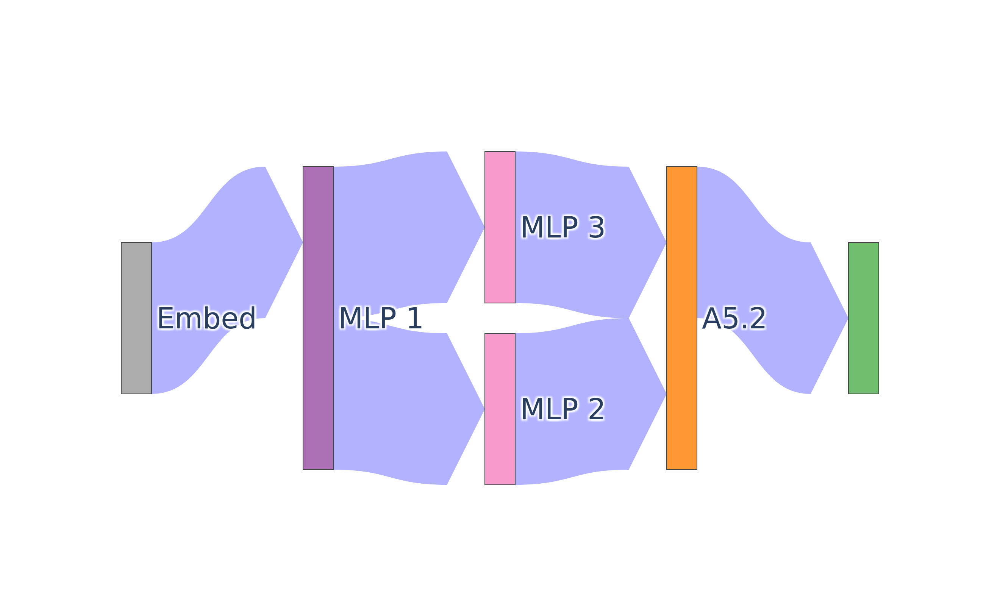

# AutoCircuit
A library for efficient patching and automatic circuit discovery.


### Installation
```
pip install auto-circuit
```

## Easy and Efficient Edge Patching
```python
--8<-- "experiments/demos/zero_ablate_an_edge.py:20:27"
```

## Different Ablation Methods
```python
--8<-- "experiments/demos/patch_some_edges.py:33:33"
```

## Automatic Circuit Discovery
```python
--8<-- "experiments/demos/circuit_discovery.py:33:41"
```

## Visualization
```python
--8<-- "experiments/demos/patch_some_edges.py:49:49"
```


